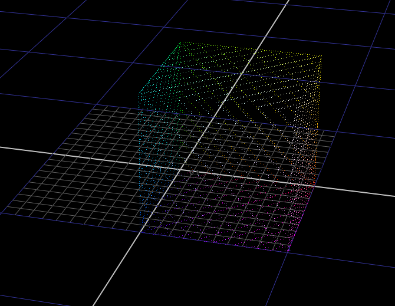
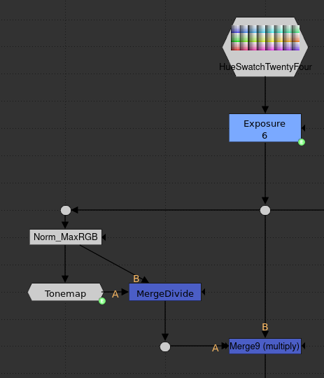
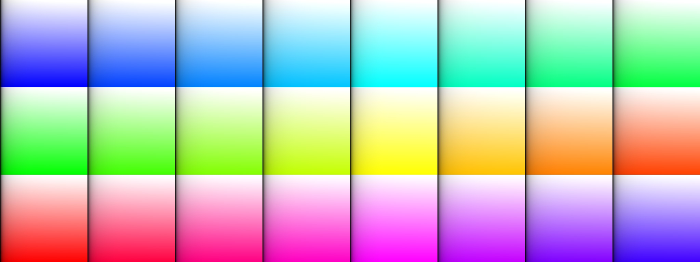

# Technical Approach

## Tonescale

Tonescale is an ACES term which refers to the process of mapping a large range of intensity values down into a lower range. Essentially it is a tonemapping operation. Most commonly this transform uses a log encoding of the scene-linear image data, and then applies some type of [sigmoidal](https://en.wikipedia.org/wiki/Sigmoid_function) s-curve. These curves usually have a linear section around middle grey, and a nonlinear section in the toe and shoulder regions of the curve, which compress shadows and highlights.

Many image makers are familiar with the process of increasing contrast in an image. When we gamma down an image we simultaneously increase contrast and saturation. When we apply an S-curve to an image, the highlights get desaturated, and the midtones and shadows get more saturated. This is because of how the nonlinear transformation affects the individual R, G, B channels. 

Many image makers have an intuitive understanding of what is happening but are unaware of the technical details. I will try to break this down and explain it here.

To explain this concept I will use this test image. 

This image contains a set of 24 hue swatches. These hue swatches are **not** perceptual, they are purely RGB values. Each hue swatch varies linearly in luminance from 0 on the left to 1 on the right. Saturation or chroma varies linearly from full chroma (at the RGB gamut boundary) (1) at the bottom to achromatic (0) at the top. 

The 1st column contains primary colors: Red green and blue. Columns 2-4 are 3 equally spaced samples between the primary colors and the secondary colors. The 5th column are the secondary colors (cyan, magenta, and yellow). And the last 3 columns are another 3 samples between the secondary colors and the primary colors. In short: 24 equally spaced chromaticity-linear lines rotating around the achromatic axis. 

Viewed on a CIE 1931 xy chromaticity diagram, and assuming an input RGB gamut of Rec.2020, the image plot looks like this.	

First we need to expose up out input image in order to get a larger scene-like range of luminance information. We will expose it up by 6 stops. This puts our 1.0 max luminance at a new value of 64. Plenty of range for compressing down!

If we take some log+s-curve tonemapping transform, and apply it directly to this exposed up image, we get something that looks like this.

On first glance it looks pretty reasonable. Filmic, almost! Not bad, but let's take a closer look. To take a closer look we are going to plot the image data directly in a 3 dimensional coordinate system. 

We can do this in Nuke using a PositionToPoints node, or by using the included PlotRGBCube gizmo. Here we can see the 0-1 display-referred luminance range of each of the primary hue directions: Green forming the up (Y) axis, and Red and Blue forming the other two horizontal (X and Z) axes. If you look closely you will notice that an achromatic triplet of (0, 0, 0) is at the origin, and an achromatic triplet of (1, 1, 1) is at the 3D position (1, 1, 1). 

If we rotate this cube 45 degrees on the Z axis and `-degrees(atan(sqrt(0.5))) ` on the X axis, we can orient the cube such that the achromatic axis is aligned to the vertical Y axis. This is useful for visualization.

Here we visualize the above per-channel tonemapped image of the hue swatches, looking directly down the achromatic axis from the top through an orthographic camera. 

Note how the primary and secondary colors maintain their "chromaticity linearity" (the straight line stays straight through the tonemapping transformation), while hues in between the primary and secondary hues collapse towards the secondaries. For example, values between pure blue and pure magenta collapse towards magenta at an alarming rate.

Fun fact, if you look closely close to the achromatic axis, you can see values collapsing towards the primary colors where shadows are being compressed.

Here is the same plot of the RGB cube but viewed from a three-quarter angle.

Here you can clearly see values between green and yellow collapsing towards yellow, and values between red and yellow collapsing towards yellow.

Let's try a chromaticity-preserving approach. This is simple to do. We can take our input RGB, take a [norm](https://en.wikipedia.org/wiki/Norm_(mathematics)) of that vector, like max(R,G,B), apply the compression to the norm, divide the compressed norm by the original norm. This results in a compression factor. We can then multiply our compression factor into our RGB, and we get a chromaticity preserving adjustment of pixel intensity.

Looking at our image we get this:

Let us take a moment and compare this with the per-channel approach. Remember the tonemapping operation is exactly the same.

Obviously there is a huge amount more saturation preserved. But remember this is an image with a max value of 64 in scene linear, so it is very bright. The behavior of the per-channel approach is closer to what we desire here, at least for it's apparent desaturation of very bright highlights. Highlights converging to achromatic with increasing exposure. This behavior is not apparent at all in the chromaticity-preserving approach, and is thus something we will have to engineer. The per-channel approach is not all perfect though. If you look closely you can see significant nonlinearities in hue as brightness increases from left to right. For example, if you look at swatch Col 2, Row 2, you can see the warm green skewing significantly towards yellow. In Col 8, Row 3, the bluish color skews significantly towards magenta. And finally in Col 8, Row 2, you can see the orange color skewing significantly towards yellow.

Anyway enough rambling, let's look at the plots of the chromaticity preserving approach!

As promised, using a chromaticity preserving tonemapping approach, straight lines stay straight and evenly spaced. 

Even when viewed from the side. If our goal is to engineer the behavior that we desire, this is a much better starting point. The per-channel approach has some of the right behaviors, and also some undesired behaviors that would be very difficult to undo. This is why I have chosen a chromaticity preserving approach as the basis for this transform, given the design goals laid out above.

The Nuke script that was used to generate these plot images is available here if you wish to view it in more detail: [plot_hueswatches-chromaticity-preserving_vs_per-channel.nk](./img/plot_hueswatches-chromaticity-preserving_vs_per-channel.nk) 

# Engineering a Path to White