# Technical Approach

## Tonescale

Tonescale is an ACES term which refers to the process of mapping a large range of intensity values down into a smaller range. Essentially it is a tonemapping operation. Most commonly this transform uses a log encoding of the scene-linear image data, and then applies some variation of a [sigmoidal](https://en.wikipedia.org/wiki/Sigmoid_function) type s-curve. These curves usually have a linear-ish section around middle grey, and a nonlinear section in the toe and shoulder regions of the curve, which compresses shadows and highlights.

Many image makers are familiar with the process of increasing contrast in an image. When we gamma down an image we simultaneously increase contrast and saturation. When we apply an S-curve to an image, the highlights get desaturated, and the midtones and shadows get more saturated. This is because of how the nonlinear transformation affects the individual R, G, B channels. 

Many image makers have an intuitive understanding of what is happening but are unaware of the technical details. I will try to break this down and explain it here in-depth.

To demonstrate this concept I will use this test image:


This image contains a set of 24 hue swatches. These hue swatches are **not** perceptual, they are purely RGB values. Each hue swatch varies linearly in luminance from 0 on the left to 1 on the right. Saturation or chroma varies linearly from full chroma (at the RGB gamut boundary) (1) at the bottom to achromatic (0) at the top. 

The 1st column contains primary colors: Red green and blue. Columns 2-4 are 3 equally spaced samples between the primary colors and the secondary colors. The 5th column are the secondary colors (cyan, magenta, and yellow). And the last 3 columns are another 3 samples between the secondary colors and the primary colors. In short: 24 equally spaced chromaticity-linear lines rotating around the achromatic axis. 

To put this another way, here are the rgb triplets for the lower right corner of each swatch in the third row which goes from red to blue.

| 1.0 0.0 0.0 | 1.0 0.0 0.25 | 1.0 0.0 0.5 | 1.0 0.0 0.75 | 1.0 0.0 1.0 | 0.75 0.0 1.0 | 0.5 0.0 1.0 | 0.25 0.0 1.0 |
| ---- | ---- | ---- | ---- | ---- | ---- | ---- | ---- |
| | | | | | | |

Viewed on a CIE 1931 xy chromaticity diagram, and assuming an input RGB gamut of Rec.2020, the image plot looks like this.	

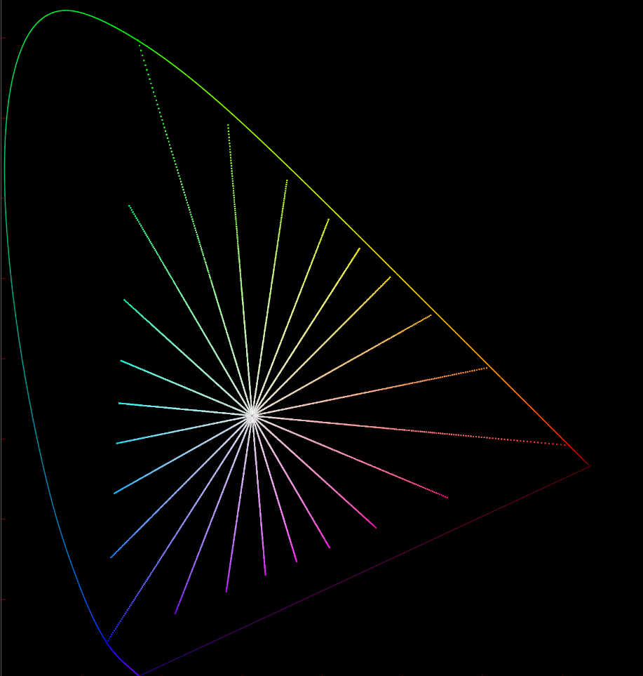

First we need to expose up our input image in order to get a larger scene-like range of luminance information. We will expose it up by 6 stops. This puts our 1.0 max luminance at a new value of 64. More range the a digital cinema camera!

If we take some log+s-curve tonemapping transform, and apply it directly to this exposed up image, we get something that looks like this.


On first glance it looks pretty reasonable. Filmic, almost! Not bad, but let's take a closer look. We are going to plot the image data directly in a 3 dimensional coordinate system. 

We can do this in Nuke using a PositionToPoints node, or by using the included [PlotRGBCube gizmo](../util/plots/PlotRGBCube.nk). Here we can see the bounds of a display-referred colorspace. It has a 0 to 1 range in each of the primary hue directions: Green forming the up (Y) axis, and Red and Blue forming the other two horizontal (X and Z) axes. If you look closely you will notice that an achromatic triplet of (0, 0, 0) is at the origin, and an achromatic triplet of (1, 1, 1) is at the 3D position (1, 1, 1). 


If we rotate this cube 45 degrees on the Z axis and `-degrees(atan(sqrt(0.5))) ` on the X axis, we can orient the cube so that the achromatic axis is aligned to the vertical Y axis. This is useful for visualization.

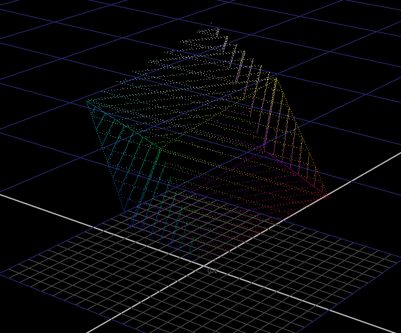

Here we visualize the above per-channel tonemapped image of the hue swatches, looking directly down the achromatic axis from the top through an orthographic camera. 


Note how the primary and secondary colors maintain their "chromaticity linearity" (the straight line stays straight through the tonemapping transformation), while hues in between the primary and secondary hues collapse towards the secondaries. For example, values between pure blue and pure magenta collapse towards magenta at an alarming rate.

Fun fact, if you look closely close to the achromatic axis, you can see values collapsing towards the primary colors where shadows are being compressed.

Here is the same plot of the RGB cube but viewed from a three-quarter angle so you can see more clearly what is happening in 3 dimensions.


Here you can clearly see colors between red and green collapsing towards yellow as exposure increases.

Let's try a chromaticity-preserving approach. This is simple to do. We can take our input RGB, take a [norm](https://en.wikipedia.org/wiki/Norm_(mathematics)) of that vector, like max(R,G,B), apply the compression to the norm, divide the compressed norm by the original norm. This results in a compression factor. We can then multiply our compression factor into our RGB, and we get a chromaticity preserving adjustment of pixel intensity.


Looking at our image we get this:


Let us take a moment and compare this with the per-channel approach. Remember the tonemapping operation is exactly the same.


Obviously there is a huge amount more saturation preserved. But remember this is an image with a max value of 64 in scene linear, so it is very bright. The behavior of the per-channel approach is closer to what we desire here, at least for it's apparent desaturation of very bright highlights. Highlights converging to achromatic with increasing exposure. This behavior is not apparent at all in the chromaticity-preserving approach, and is thus something we will have to engineer. 

The per-channel approach is not perfect however. If you look closely you can see significant nonlinearities in hue as brightness increases from left to right. For example, if you look at swatch Col 2, Row 2, you can see the warm green skewing significantly towards yellow. In Col 8, Row 3, the bluish color skews significantly towards magenta. And finally in Col 8, Row 2, you can see the orange color skewing significantly towards yellow.

Let's look at plots of the chromaticity preserving approach! As promised, using a chromaticity preserving tonemapping approach, straight lines stay straight and evenly spaced. 


Even when viewed from the side.


If our goal is to engineer the behavior that we desire, this is a much better starting point. The per-channel approach has some of the right behaviors, and also some undesired behaviors that would be very difficult to undo. This is why I have chosen a chromaticity preserving approach as the basis for this transform, given the design goals laid out.

The Nuke script that was used to generate these plot images is available here if you wish to view these plots in more detail: [plot_hueswatches-chromaticity-preserving_vs_per-channel.nk](./img/plot_hueswatches-chromaticity-preserving_vs_per-channel.nk) 

# RGB Ratios Model

The model I'm using is based on the concept of splitting RGB into a norm that represents the achromatic axis, or the neutral values, and RGB ratios that represent the color information. Operating independently on color and luminance is valuable because it lets us control chroma, hue and luminance independently. 

Let's put some pictures to these ideas. Here again are our set of 24 hue swatches.


If we take the `max(r,g,b)` norm of these rgb values, we get a representation of the achromatic axis. This shows us luminance separated from color.

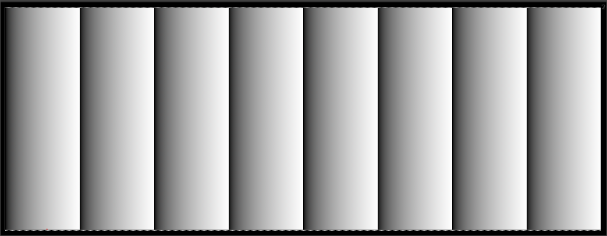

Using the norm we can extract the inverse rgb ratios. There are a couple of different ways to do this: 

```
norm = max(r, max(g, b))

# option 1: calculate inverse rgb ratios directly
inverse_rgb_rats = (norm - rgb) / norm

# option 2: calculate rgb ratios
rgb_rats = rgb / norm
inverse_rgb_rats = 1.0 - rgb_rats
```

Inverse rgb ratios represent the achromatic value at 0.0, and represent increasing chroma in the complementary hue directions (essentially cyan, magenta, yellow saturation). A inverse rgb ratio of 1.0 is at the RGB gamut prism boundary. We exploited this characteristic in the design of the [GamutCompress algorithm](https://github.com/jedypod/gamut-compress) for the [ACES gamut mapping virtual working group](https://community.acescentral.com/c/aces-development-acesnext/vwg-aces-gamut-mapping-working-group).


If you take `max(r,g,b)` of the inverse RGB ratios you get a hexagonal representation of chroma. Interestingly this is identical to `max(r,g,b) - min(r,g,b)` which is identical to S in hexagonal HSV.

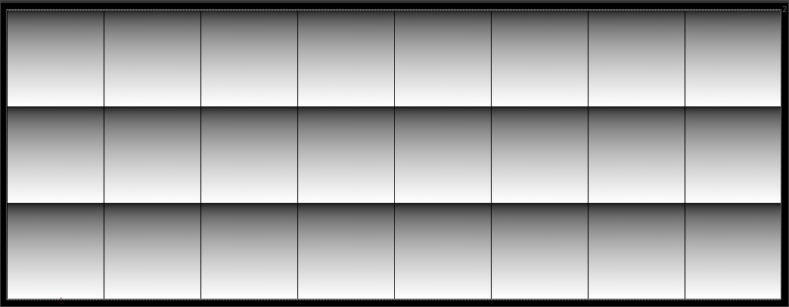

Instead of taking `max(r,g,b)`, if we weight the inverse rgb ratios by the luminance weights for the rendering gamut, we get a perceptually weighted representation of chroma. This is useful because it is desireable in a display rendering transform to control the behavior of different hue regions according to perceptual  attributes. For example, yellow and green should desaturate more quickly than blues and reds. Similarly blues and reds should appear darker at lower luminance levels, and brighter at higher luminance levels to maintain a natural appearance, at least with the subjective testing that I have done and the other display rendering transforms I have been referencing. Here's how the luminance weighting is calculated.

``` 
# To calculate a luminance weighting, we need to know the render gamut. In thise case it is Rec.2020
# The 3x3 matrix to convert from Rec.2020 to XYZ is 
# 0.67016053, 0.15215525, 0.17768414, 
# 0.26270026, 0.67799819, 0.05930173, 
# -0.00000000, 0.02577705, 0.97422290
# If we take the 2nd row, these are our R, G, and B weights.
# To calculate luminance weights form the inverse rgb ratios, we do 

norm = max(r, max(g, b))
irgb = (norm - rgb) / norm
lum_w = (float3)(irgb.x * 0.26270026 + irgb.y * 0.67799819 + irgb.z * 0.05930173)
```

Here is what luminance weighted inverse rgb ratios looks like:


"Forward" rgb ratios are also useful. They look like this. Instead of the achromatic axis being at 0.0, it is at 1.0. This means we can multiply these values to get a "more intense" color in certain regions. I'm not sure how to describe this properly, but it seems like an important facet of this model to achieve vibrant color.

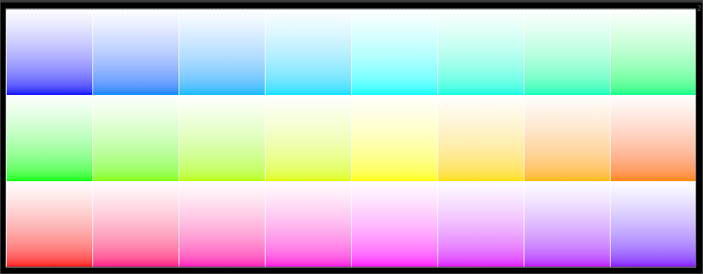

# Engineering a Path to White

Here is one method to engineer a path to white for high intensity input colors. This time we'll remove the chroma ramp, and keep fully saturated color from top to bottom.

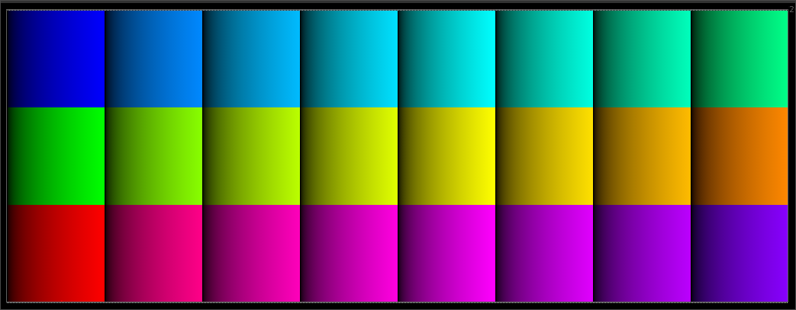

And then we will expose up our image to get some insanely bright insanely saturated input colors to test. (Shown here with a simple gamma 2.2 transform - note the collapse towards the secondary colors: cyan magenta and yellow!)

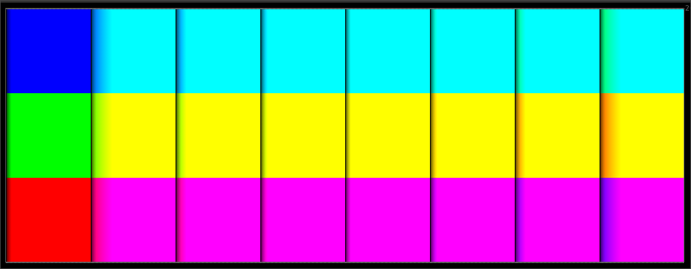

We'll take the norm using our max(r,g,b) method (note that this image has the intensity compression curve - the Tonescale already applied for display purposes).

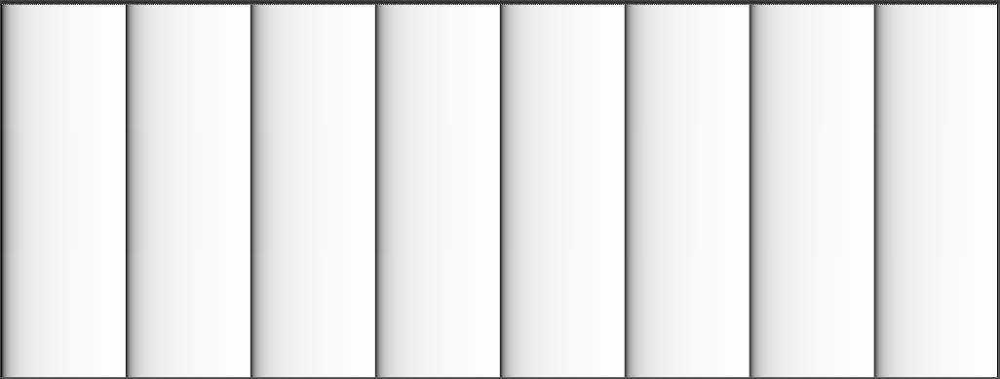

From the max(r,g,b) norm, we can calculate the inverse rgb ratios.

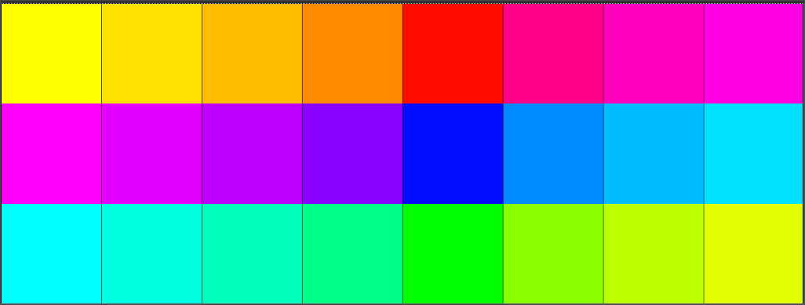

And the luminance weights


We can bias our compressed norm with something like a power function. This specifies how much of the highlight region we want to affect with our path to white.


We can then use the luminance weights and the path to white factor, and combine the two, but only in the upper regions of the luminance range. There's more intricacy to this, but I will leave it vague for now as I continue to work on developing the model to be simpler! If you're curious you can dig into the nuke node and poke around.


# Perceptual Model

When a path to white is taken that goes directly from the chromaticity towards the achromatic axis along a linear path, shifts in the perceived hue can occur because of the [Abney effect](https://en.wikipedia.org/wiki/Abney_effect).To compensate for this we can use a perceptual model to alter the path that the hue takes. Our model will no longer be chromaticity preserving, but it is a subtle change and looks a lot better, especially for saturated blue colors, and reddish orange hues.

I am using the excellent and extremely simple [oklab colorspace](https://bottosson.github.io/posts/oklab/) from [Bjorn Ottosson](https://bottosson.github.io). I am only using it to compensate for the path to white, not for the gamut compression, as it seems to behave a bit strangely for hues that are outside of the spectral locus. (Not surprising). Basically what I do is convert source and destination rgb ratios to oklab LCh cylindrical. Since we are operating on rgb ratios independently from luminance, we shouldn't see much of a luminance shift. Destination rgb ratios have had the path to white applied. We copy hue from source to destination, and then inverse back to render gamut rgb.

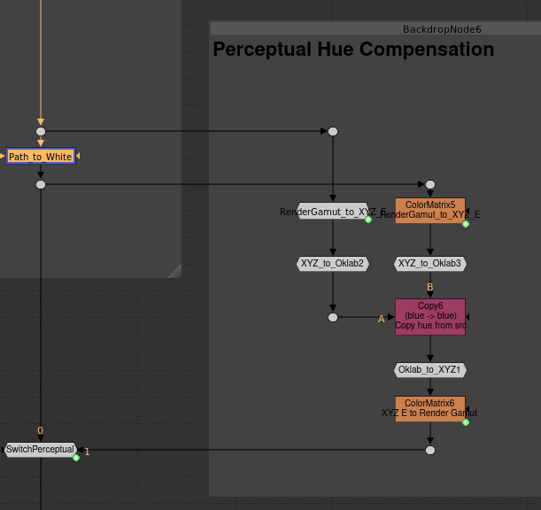

Here are two hue swatches: a pure blue, and a pure red, rendered through the display transform with a path to white applied. Note the purple and pinkish hues on the blue and red as it goes towards white.


Here is the same image with the oklab perceptual model applied.


And here is the notorious blue bar image, rendered through the Open Display Transform. First with a chromaticity linear path to white.


And next with a perceptually adjusted path to white.

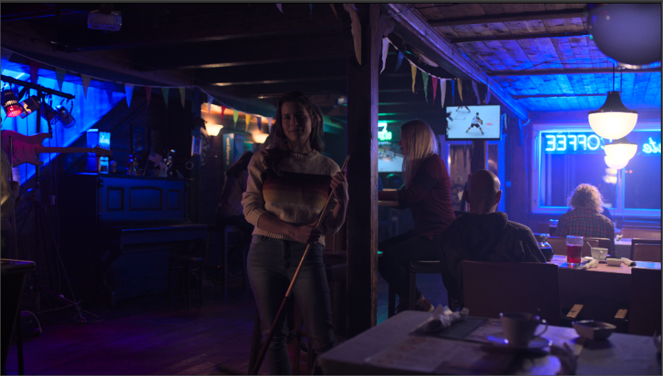

It helps a bit with fire as well. Here is one of the images from the [Output Transform image submissions](www.dropbox.com/sh/zea11rkxkivv7w7/AADM8TB9tmpI9qdLB5JvRb-ra) - an explosion vdb lookdev'd and rendered by Liam Collod. First with a chromaticity-linear path to white.


And next with a perceptual path to white.

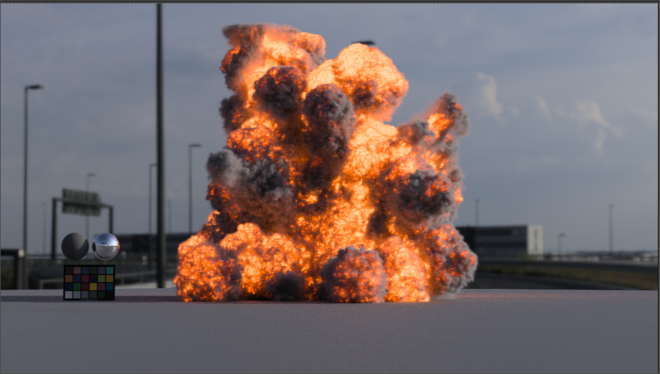

And it even helps preserve tonality in crazy images with really saturated out of gamut colors. First with chromaticity-linear path to white.


Next with perceptual path to white.


# Gamut Compression

Handling out of gamut color values is a complex multi-dimensional problem that is interwoven through the entire processing chain. Because the sensors of digital cinema cameras are not colorimetric devices, they have a different spectral sensitivity than a human observer. One could say that there is the human observer, and there is the camera observer. This difference in spectral senstivity can result in rgb triplets that are somehow "impossibly" outside of the spectral locus in a CIE 1931 xy chromaticity diagram.


Above is a chromaticity diagram. You can see the familiar horse-shoe shape of the spectral locus for the standard human observer, as calculated by the CIE in 1931. The [planckian locus](https://en.wikipedia.org/wiki/Planckian_locus) is the curved line, and the little plus is the xy chromaticity of [illuminant D65](https://en.wikipedia.org/wiki/Illuminant_D65), a common whitepoint for many colorspaces. Plotted are the triangles for 3 gamuts. The smallest one is Rec.709. The middle one is Arri Alexa WideGamut. The biggest one is [Filmlight E-Gamut](https://www.filmlight.ltd.uk/workflow/truelight.php).

What does all this mean? If we are doing a display transform for an image that was captured with an Arri Alexa, and filmed a saturated blue light source, we might have chromaticities outside of the spectral locus in the blue corner of the Alexa WideGamut triangle. Note that this would be true even if the Alexa Wide Gamut image was converted to ACEScg with a 3x3 Matrix - in this case those chromaticities would just be represented by a negative blue RGB component. To elegantly handle situations like this we need to have some sort of gamut compression functionality, in order to compress those chromaticity values towards the achromatic axis, so that they can be rendered properly in the smaller display gamut.

Here is a particularly challenging image we'll use to show what this looks like. It is `beerfest_lightshow_04` frame x3492 from the [Stuttgart VM Lab test images](https://www.hdm-stuttgart.de/vmlab/hdm-hdr-2014). 

Here is the image rendered through the Open Display Transform node, without perceptual, without gamut compression.


And here is a plot of the chromaticities of the input image. In this processing, the image was converted from Alexa Wide Gamut linear to ACEScg. Note the chromaticities outside of the spectral locus in the blue corner.

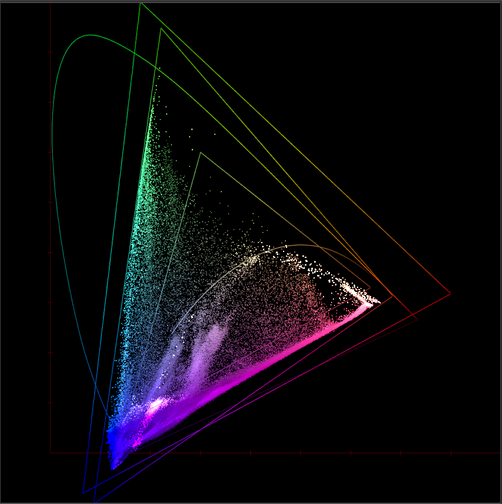

If we enable a subtle gamut compression, it helps bring the highly saturated blue colors a bit closer to the achromatic axis, and we get a bit more tonality preserved. Note that the highlights were already pretty well handled by the path to white chroma compression, so it's a small change. Note that in the current implementation this gamut compression is *not* chromaticity linear - it uses the same idea as the GamutCompress tool, so it introduces some hue shifts. For blue hues it actually looks similar to the perceptual model though.


And if we enable our perceptual path to white processing, it removes some of those subtle purple hues in the highlights.


Finally, for comparison, here is the ACES Rec.709 Output Transform.


The artifacts here are are partly due to the lack of gamut mapping in the ACES transform, and partly due to the per-channel nature of the algorithm.

# Test Footage

All of the Nuke tools here are fully functional in Nuke Non-Commercial. If you would like to test them out I have uploaded a selection of wide gamut scene-referred test images in exr format to a dropbox folder here: [Test Footage](https://www.dropbox.com/sh/fdm7mtxj8w103cg/AADXWcS7KEDik85rIELLTCd6a). It contains 2k scene-linear images, mostly encoded in ACES AP0 colorspace. 

These images were acquired from the following open sources:

- [ACES Gamut Mapping Virtual Working Group Image Submissions](https://www.dropbox.com/sh/u6z2a0jboo4vno8/AAB-10qcflhpr0C5LWhs7Kq4a)

- [ACES Output Transform Image Submissions](https://www.dropbox.com/sh/zea11rkxkivv7w7/AADM8TB9tmpI9qdLB5JvRb-ra)

- [Arri Camera Sample Footage](https://www.arri.com/en/learn-help/learn-help-camera-system/camera-sample-footage)

- [Red Sample R3D Files](https://www.red.com/sample-r3d-files)

- [Stuttgart Visual Media Lab HDR Test Footage](https://www.hdm-stuttgart.de/vmlab/hdm-hdr-2014/#FTPdownload)

- [Blackmagic Raw Test Footage](https://www.blackmagicdesign.com/ca/products/blackmagicpocketcinemacamera/gallery)

  