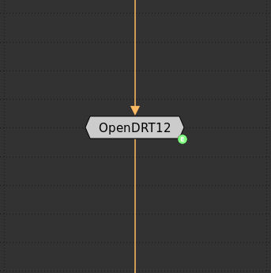
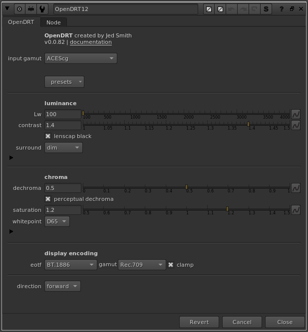
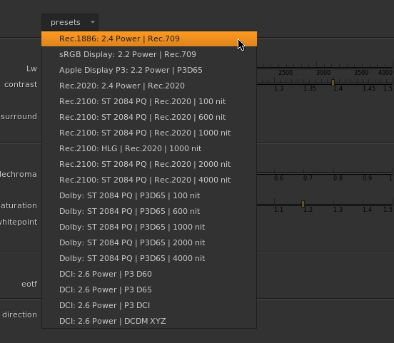
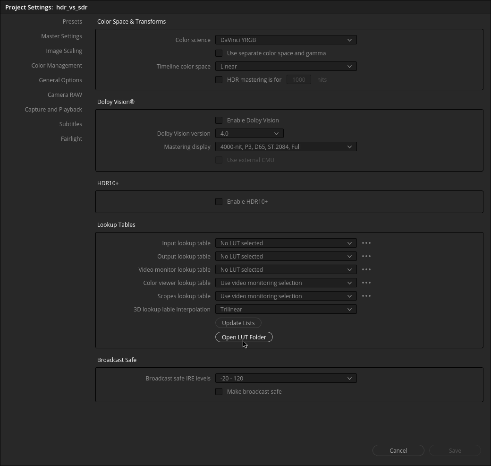
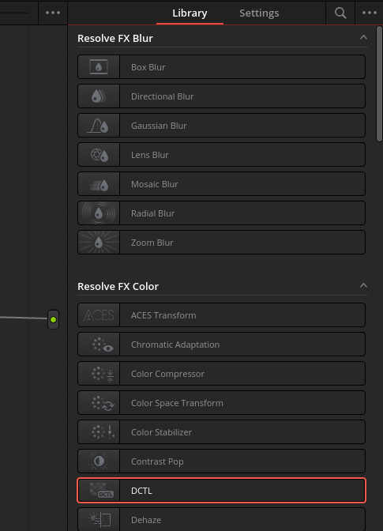
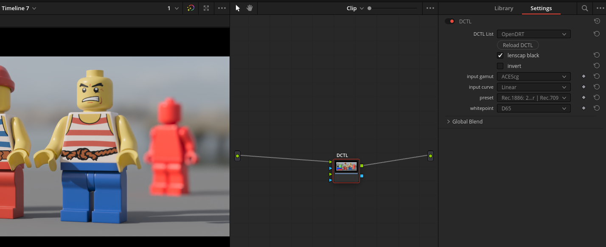

# Installing OpenDRT

Just a few easy steps can get you up and running with OpenDRT.

OpenDRT is supported in [Nuke](https://www.foundry.com/products/nuke) or [Nuke Non-Commercial](https://www.foundry.com/products/nuke/non-commercial), and in [DaVinci Resolve Studio](https://www.blackmagicdesign.com/ca/products/davinciresolve/studio) as a DCTL plugin.

## Nuke

1. Download Nuke script from the [latest release](https://github.com/jedypod/open-display-transform/releases). 
2. OpenDRT node is provided as a Group node, so you can simply drag and drop the OpenDRT.nk file into your node graph. Or if you like you can open the OpenDRT.nk file in a text editor, and copy/paste into your node graph.

3. Connect up the node as desired and make sure to set the input gamut correctly.
   
4. Now you can choose a preset that is matching your viewing condition.
   

## Resolve

1. Download the dctl files from the [latest release](https://github.com/jedypod/open-display-transform/releases). 
2. Copy the dctl files to the LUT/DCTL folder in your Resolve installation. You can find the LUT folder on your platform by going to the Project Settings (`Shift+9`) -> Color Management, and click the Open LUT Folder button.
   
3. Restart Resolve.
4. Now you can create the DCTL node by dragging it into the node graph.
   
5. Find the OpenDRT DCTL by selecting it from the list.
   
6. Select the input gamut and transfer function, and the preset for your desired viewing condition, and you're good to go!

# Next up...
Let's [learn how to use this thing](doc_parameters.md).