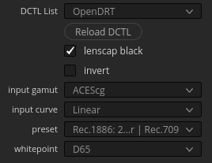
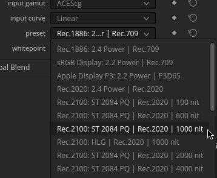

# OpenDRT Parameters

## Resolve

Here is the default DCTL node loaded in Resolve Studio:

By default OpenDRT has very few parameters exposed. This is intentional. OpenDRT is **not** a grading tool. It is a display transform. Its purpose is to render a scene-referred input to a display referred output, in a consistent and predictable way.

The available parameters are as follows:

- **input gamut**
  Choose the gamut of the input colorspace. For example if you are working on Arri footage, this might be Alexa Wide Gamut.
- **input curve**
  Choose the transfer function of the input. For example if you are working on Red footage, this might be Red Log3G10.
- **preset**
  Choose the preset that best defines the viewing condition of your intended output. The viewing condition describes the display device and surround conditions. For example if you are targeting standard SDR video, this might be set to Rec.1886, which renders the image for a 100 nit peak brightness monitor in a 5 nit ambient surround, as specified by [ITU-R Rec.709](https://www.itu.int/rec/R-REC-BT.709). If you're rendering for HDR output, this might be Rec.2100 ST 2084 PQ, which renders the image for HDR10 output according to [ITU-R Rec.2100](https://www.itu.int/rec/R-REC-BT.2100).
  
- **whitepoint**
  Sets the [creative whitepoint](tech_creative_whitepoint.md). This allows you to creatively set the whitepoint of your display rendering if you want it to be different than the technical whitepoint of your display device. For example if you set this to D55, neutral colors will be rendered as a warmer hue compared to the default D65.
- **lenscap black** 
  Adds a small offset so that negative values in the noise floor of your input image are not clipped. Disable this if you are manually adding this offset while grading.
- **invert**
  Inverts the direction of the display transform. Useful if you have display-referred input imagery that you need to bring into the same working colorspace as your other footage. Be aware that a perfect inverse from display-referred to scene-referred is not possible because of the limitations of the display gamut volume. Consider this an approximation, and be very cautious if using this workflow. **HIC SUNT DRACONES**.

## Nuke

The same parameters as described above exist in Nuke, but there are additional ones exposed by default. Unless you are an expert user, please stick to adjusting only the parameters described above, and using the presets. Otherwise, proceed to the [technical documentation]() for more information.
