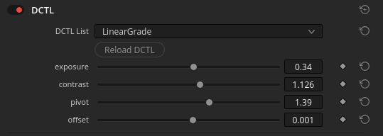
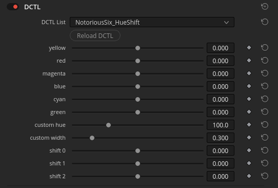

# Look Modification
Here you will find some tools to create look modification transforms, as well as some pre-built look presets.

## Tools
- **Nayatani_HK** : [Nuke](tools/nuke/Nayatani_HK.nk) | [Resolve](tools/resolve/Nayatani_HK.dctl)  
  Implements the [Nayatani (1997) model](https://doi.org/10.1002/(SICI)1520-6378(199608)21:4<252::AID-COL1>3.0.CO;2-P) for [Helmholtz-Kohlrausch effect](https://en.wikipedia.org/wiki/Helmholtz%E2%80%93Kohlrausch_effect) compensation.
- **LinearGrade** : [Nuke](tools/nuke/LinearGrade.nk) | [Resolve](tools/resolve/LinearGrade.dctl)  
  Very simple chromaticity-preserving scene-linear grade operator: `offset -> pivoted contrast -> exposure`  
  
- **NotoriousSix_HueShift** : [Nuke](tools/nuke/NotoriousSix_HueShift.nk) | [Resolve](tools/resolve/NotoriousSix_HueShift.dctl)  
  Hue shift tool. Allows smooth shifts of hue per hue angle, for each of the primary and secondary colors: RGB, CMY. With an additional hue shift for a custom angle and width. Preset is for orange. You can also enable a zoned range selection, which will limit the hue shift to a range of input luminance, depending on how you set the zone range slider. Lower values include more midtones and shadows, higher less.
  

## Look Presets
- Stay tuned ...
